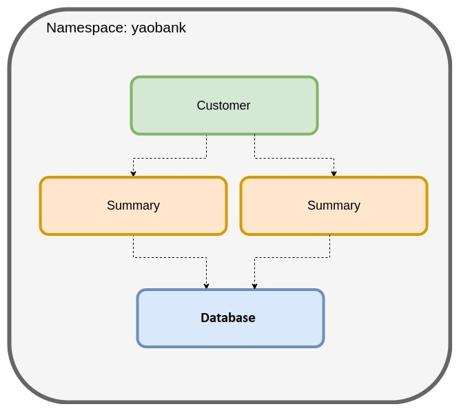
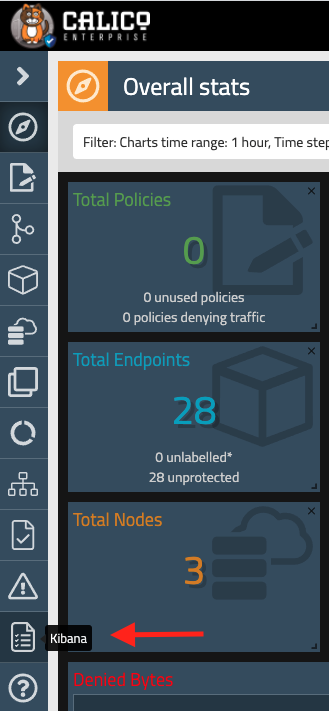

# 1. Installing Calico Enterprise on K8s

The first lab guides you through the process of installing Calico and deploying a sample application. 

Steps:\
1.1. Install Calico Enterprise\
1.2. Launch a sample application (Yaobank)\
1.3. Configure the ingress, and service account\
1.4. Access the application, Calico Enterprise UI, and Kibana


## 1.1. Install Calico Enterprise

### 1.1.1. Check the environment, and prepare the nodes

Your lab consists of a cluster of three nodes with a single master, and a bastion host from where you access the environment and simulate external connectivity. Kubernetes has been preinstalled, but as your network plugin is not there yet, your nodes will appear as NotReady:

```
kubectl get nodes
```
```
NAME                                         STATUS   ROLES                  AGE   VERSION
ip-10-0-1-20.ca-central-1.compute.internal   Ready    control-plane,master   10h   v1.20.6
ip-10-0-1-30.ca-central-1.compute.internal   Ready    worker                 10h   v1.20.6
ip-10-0-1-31.ca-central-1.compute.internal   Ready    worker                 10h   v1.20.6
```
### 1.1.2. Prepare the storage

First configure storage for Calico Enterprise, we will use AWS EBS provided by the AWS cloud provider integration.

```
kubectl apply -f -<<EOF
apiVersion: storage.k8s.io/v1
kind: StorageClass
metadata:
  name: tigera-elasticsearch
provisioner: kubernetes.io/aws-ebs
parameters:
  type: gp2
  fsType: ext4
reclaimPolicy: Retain
allowVolumeExpansion: true
volumeBindingMode: WaitForFirstConsumer
EOF

```

Make sure the storageclass has been created successfully:

```
kubectl get storageclass
```
```
NAME                   PROVISIONER             RECLAIMPOLICY   VOLUMEBINDINGMODE      ALLOWVOLUMEEXPANSION   AGE
tigera-elasticsearch   kubernetes.io/aws-ebs   Retain          WaitForFirstConsumer   true                   10s
```

### 1.1.3. Make an operator based install

Calico will be the networking (CNI) and network policy implementation throughout your training lab. To install Calico, we will use an operator, so it will implement and automate the lifecycle of our calico deployment:

```
kubectl create -f https://docs.tigera.io/v3.7/manifests/tigera-operator.yaml

```

We need to implement an operator for the prometheus component too:

```
kubectl create -f https://docs.tigera.io/v3.7/manifests/tigera-prometheus-operator.yaml

```

Check tigera-operator has been successfully rolled out:

```
kubectl rollout status -n tigera-operator deployment tigera-operator
```

Now, we must specify the pull secret we will use to download the required images from tigera:

```
kubectl create secret generic tigera-pull-secret \
    --from-file=.dockerconfigjson=/home/tigera/config.json \
    --type=kubernetes.io/dockerconfigjson -n tigera-operator
```

Then, we can apply the manifest which will create the custom resources and required configs:

```
kubectl apply -f -<<EOF
# This section includes base Calico Enterprise installation configuration.
# For more information, see: https://docs.tigera.io/v3.7/reference/installation/api#operator.tigera.io/v1.Installation
apiVersion: operator.tigera.io/v1
kind: Installation
metadata:
  name: default
spec:
  # Install Calico Enterprise
  variant: TigeraSecureEnterprise

  # Define a smaller cidr for the pods
  calicoNetwork:
    ipPools:
    - cidr: "10.48.0.0/24"
      encapsulation: None

  # List of image pull secrets to use when installing images from a container registry.
  # If specified, secrets must be created in the `tigera-operator` namespace.
  imagePullSecrets:
    - name: tigera-pull-secret

  # Optionally, a custom registry to use for pulling images.
  # registry: <my-registry>

---

# This section configures the Tigera web manager.
# Remove this section for a Managed cluster.
# For more information, see: https://docs.tigera.io/v3.7/reference/installation/api#operator.tigera.io/v1.Manager
apiVersion: operator.tigera.io/v1
kind: Manager
metadata:
  name: tigera-secure
spec:
  # Authentication configuration for accessing the Tigera manager.
  # Default is to use token-based authentication.
  auth:
    type: Token

---

# This section installs and configures the Calico Enterprise API server.
# For more information, see: https://docs.tigera.io/v3.7/reference/installation/api#operator.tigera.io/v1.APIServer
apiVersion: operator.tigera.io/v1
kind: APIServer
metadata:
  name: tigera-secure

---

# This section installs and configures Calico Enterprise compliance functionality.
# For more information, see: https://docs.tigera.io/v3.7/reference/installation/api#operator.tigera.io/v1.Compliance
apiVersion: operator.tigera.io/v1
kind: Compliance
metadata:
  name: tigera-secure

---

# This section installs and configures Calico Enterprise intrusion detection functionality.
# For more information, see: https://docs.tigera.io/v3.7/reference/installation/api#operator.tigera.io/v1.IntrusionDetection
apiVersion: operator.tigera.io/v1
kind: IntrusionDetection
metadata:
  name: tigera-secure

---

# This section configures the Elasticsearch cluster used by Calico Enterprise.
# Remove this section for a Managed cluster.
# For more information, see: https://docs.tigera.io/v3.7/reference/installation/api#operator.tigera.io/v1.LogStorage
apiVersion: operator.tigera.io/v1
kind: LogStorage
metadata:
  name: tigera-secure
spec:
  nodes:
    count: 1

---

# This section configures collection of Tigera flow, DNS, and audit logs.
# For more information, see: https://docs.tigera.io/v3.7/reference/installation/api#operator.tigera.io/v1.LogCollector
apiVersion: operator.tigera.io/v1
kind: LogCollector
metadata:
  name: tigera-secure

---
# Source: tigera-operator/templates/crs/prometheus/alertmanager.yaml

# This section installs a Prometheus alert manager.
apiVersion: monitoring.coreos.com/v1
kind: Alertmanager
metadata:
  name: calico-node-alertmanager
  namespace: tigera-prometheus
spec:
  version: v0.20.0
  baseImage: quay.io/prometheus/alertmanager
  nodeSelector:
    kubernetes.io/os: linux
  replicas: 3

---
# Source: tigera-operator/templates/crs/prometheus/prometheus.yaml

# This section configures the Calico Enterprise Prometheus deployment.
apiVersion: monitoring.coreos.com/v1
kind: Prometheus
metadata:
  name: calico-node-prometheus
  namespace: tigera-prometheus
spec:
  baseImage: quay.io/prometheus/prometheus
  nodeSelector:
    kubernetes.io/os: linux
  serviceAccountName: prometheus
  serviceMonitorSelector:
    matchLabels:
      team: network-operators
  podMonitorSelector:
    matchLabels:
      team: network-operators
  version: v2.17.2
  retention: 24h
  resources:
    requests:
      memory: 400Mi
  ruleSelector:
    matchLabels:
      role: tigera-prometheus-rules
      prometheus: calico-node-prometheus
  alerting:
    alertmanagers:
      - namespace: tigera-prometheus
        name: calico-node-alertmanager
        port: web
        scheme: http

---
# Source: tigera-operator/templates/crs/prometheus/prometheusrule.yaml

# This section configures denied packets alerting rules in Prometheus.
apiVersion: monitoring.coreos.com/v1
kind: PrometheusRule
metadata:
  name: tigera-prometheus-dp-rate
  namespace: tigera-prometheus
  labels:
    role: tigera-prometheus-rules
    prometheus: calico-node-prometheus
spec:
  groups:
  - name: calico.rules
    rules:
    - alert: DeniedPacketsRate
      expr: rate(calico_denied_packets[10s]) > 50
      labels:
        severity: critical
      annotations:
        summary: "Instance {{$labels.instance}} - Large rate of packets denied"
        description: "{{$labels.instance}} with calico-node pod {{$labels.pod}} has been denying packets at a fast rate {{$labels.sourceIp}} by policy {{$labels.policy}}."

---
# Source: tigera-operator/templates/crs/prometheus/servicemonitor.yaml

# This section configures Prometheus monitoring of calico/node metrics.
apiVersion: monitoring.coreos.com/v1
kind: ServiceMonitor
metadata:
  name: calico-node-monitor
  namespace: tigera-prometheus
  labels:
    team: network-operators
spec:
  selector:
    matchLabels:
      k8s-app: calico-node
  namespaceSelector:
    matchNames:
    - calico-system
  endpoints:
  - port: calico-metrics-port
    interval: 5s
    scrapeTimeout: 5s
    honorLabels: true
  - port: calico-bgp-metrics-port
    interval: 5s
    scrapeTimeout: 5s
    honorLabels: true

---
# Source: tigera-operator/templates/crs/prometheus/elasticsearch_servicemonitor.yaml

apiVersion: monitoring.coreos.com/v1
kind: ServiceMonitor
metadata:
  name: elasticsearch-metrics
  namespace: tigera-prometheus
  labels:
    team: network-operators
spec:
  selector:
    matchLabels:
      k8s-app: tigera-elasticsearch-metrics
  namespaceSelector:
    matchNames:
      - tigera-elasticsearch
  endpoints:
    - port: metrics-port
      interval: 5s
      scrapeTimeout: 5s
      honorLabels: true

---
# Source: tigera-operator/templates/crs/prometheus/fluentd_podmonitor.yaml

apiVersion: monitoring.coreos.com/v1
kind: PodMonitor
metadata:
  name: fluentd-metrics
  namespace: tigera-prometheus
  labels:
    team: network-operators
spec:
  selector:
    matchLabels:
      k8s-app: fluentd-node
  namespaceSelector:
    matchNames:
      - tigera-fluentd
  podMetricsEndpoints:
    - port: metrics-port
      interval: 5s
      scrapeTimeout: 5s
      honorLabels: true
EOF

```

And check the components start progressing:

```
watch kubectl get tigerastatus
```

### 1.1.4. Apply the license

Wait util the `apiserver` shows an status of `True` under the `Available` column, then press `Ctrl+C` to return to the prompt, and apply the license file:

```
kubectl create -f /home/tigera/license.yaml
```

Check all components become available before proceding further (this can take few minutes):

```
watch kubectl get tigerastatus
```
You should an output similar to the following.

```                                                                                                                                     
NAME                  AVAILABLE   PROGRESSING   DEGRADED   SINCE
apiserver             True        False         False      4m54s
calico                True        False         False      4m39s
compliance            True        False         False      119s
intrusion-detection   True        False         False      2m14s
log-collector         True        False         False      114s
log-storage           True        False         False      2m14s
manager               True        False         False      89s
```

### 1.1.5. Secure calico system components

As part of the installtion process, we will implement Network security Policies to protect calico components but allow the communication between them, so we can follow a zero trust security approach. Implement the following calico network policies to the environment:

```
kubectl create -f https://docs.tigera.io/manifests/tigera-policies.yaml
```

### 1.1.6. Install the calicoctl utility

Perform the commands below to install teh calicoctl client:

```
curl -o calicoctl -O -L https://docs.tigera.io/download/binaries/v3.7.0/calicoctl
```
```
chmod +x calicoctl
```
```
sudo mv calicoctl /usr/local/bin/
```

Check the installed Calico version in your lab:

```
calicoctl version
```

Please confirm the "Cluster Calico Enterprise Version" matches the calicoctl version in "Client Version", otherwise please raise this to your instructor

Configure autocomplete for kubectl.

```
sudo apt-get install bash-completion
source /usr/share/bash-completion/bash_completion
echo 'source <(kubectl completion bash)' >>~/.bashrc
source ~/.bashrc
```

## 1.2. Launch the sample applications (yaobank)

For this lab, we will use a sample application called "Yet Another Online Bank" (yaobank) which consists of 3 microservices.
1. Customer (which provides a simple web GUI)
2. Summary (some middleware business logic)
3. Database (the persistent datastore for the bank)


The following diagram shows the logical diagram of the application.




### 1.2.1. Launch the application using the following commands

```
kubectl apply -f -<<EOF
apiVersion: v1
kind: Namespace
metadata:
  name: yaobank
  labels:
    istio-injection: disabled
    tenant: tenant1

---
apiVersion: v1
kind: Service
metadata:
  name: database
  namespace: yaobank
  labels:
    app: database
    tenant: tenant1
spec:
  ports:
  - port: 2379
    name: http
  selector:
    app: database

---
apiVersion: v1
kind: ServiceAccount
metadata:
  name: database
  namespace: yaobank
  labels:
    app: yaobank
    tenant: tenant1

--- 
apiVersion: apps/v1
kind: Deployment
metadata:
  name: database
  namespace: yaobank
spec:
  selector:
    matchLabels:
      app: database
      version: v1
      tenant: tenant1
  replicas: 1
  template:
    metadata:
      labels:
        app: database
        version: v1
        tenant: tenant1
    spec:
      serviceAccountName: database
      containers:
      - name: database
        image: calico/yaobank-database:certification
        imagePullPolicy: IfNotPresent
        ports:
        - containerPort: 2379
        command: ["etcd"]
        args:
          - "-advertise-client-urls"
          - "http://database:2379"
          - "-listen-client-urls"
          - "http://0.0.0.0:2379"

---
apiVersion: v1
kind: Service
metadata:
  name: summary
  namespace: yaobank
  labels:
    app: summary
    tenant: tenant1
spec:
  ports:
  - port: 80
    name: http
  selector:
    app: summary
    
---
apiVersion: v1
kind: ServiceAccount
metadata:
  name: summary
  namespace: yaobank
  labels:
    app: yaobank
    database: reader
    tenant: tenant1
    
---
apiVersion: apps/v1
kind: Deployment
metadata:
  name: summary
  namespace: yaobank
spec:
  replicas: 2
  selector:
    matchLabels:
      app: summary
      version: v1
      tenant: tenant1
  template:
    metadata:
      labels:
        app: summary
        version: v1
        tenant: tenant1
    spec:
      serviceAccountName: summary
      containers:
      - name: summary
        image: calico/yaobank-summary:certification
        imagePullPolicy: Always
        ports:
        - containerPort: 80
 
---
apiVersion: v1
kind: Service
metadata:
  labels:
    app: customer
    tenant: tenant1
  name: customer
  namespace: yaobank
spec:
  ports:
  - name: http
    port: 80
  selector:
    app: customer

---
apiVersion: v1
kind: ServiceAccount
metadata:
  name: customer
  namespace: yaobank
  labels:
    app: yaobank
    summary: reader
    tenant: tenant1
    
---
apiVersion: apps/v1
kind: Deployment
metadata:
  name: customer
  namespace: yaobank
spec:
  replicas: 1
  selector:
    matchLabels: 
      app: customer
      version: v1
      tenant: tenant1
      ingress: "true"
  template:
    metadata:
      labels:
        app: customer
        version: v1
        tenant: tenant1
        ingress: "true"
    spec:
      serviceAccountName: customer
      containers:
      - name: customer
        image: calico/yaobank-customer:certification
        imagePullPolicy: Always
        ports:
        - containerPort: 80
EOF
```

We will deploying other two applications too in order to showcase multitenancy, and those will be deployed on different namespaces (`app1`, and `app2`):

```
kubectl apply -f -<<EOF
apiVersion: v1
kind: Namespace
metadata:
  name: app1
  labels:
    tenant: tenant1

---

apiVersion: apps/v1
kind: Deployment
metadata:
  name: app1-deployment
  namespace: app1
  labels:
    app: app1
    tenant: tenant1
spec:
  replicas: 2
  selector:
    matchLabels:
      app: app1
      tenant: tenant1
  template:
    metadata:
      labels:
        app: app1
        tenant: tenant1
    spec:
      containers:
      - name: app1
        image: praqma/network-multitool
        env:
        - name: HTTP_PORT
          value: "1180"
        - name: HTTPS_PORT
          value: "11443"
        ports:
        - containerPort: 1180
          name: http-port
        - containerPort: 11443
          name: https-port
        resources:
          requests:
            cpu: "1m"
            memory: "20Mi"
          limits:
            cpu: "10m"
            memory: "20Mi"

---

apiVersion: v1
kind: Namespace
metadata:
  name: app2
  labels:
    tenant: tenant2

---

apiVersion: apps/v1
kind: Deployment
metadata:
  name: app2-deployment
  namespace: app2
  labels:
    app: app2
    tenant: tenant2
spec:
  replicas: 2
  selector:
    matchLabels:
      app: app2
      tenant: tenant2
  template:
    metadata:
      labels:
        app: app2
        tenant: tenant2
    spec:
      containers:
      - name: app2
        image: praqma/network-multitool
        env:
        - name: HTTP_PORT
          value: "1180"
        - name: HTTPS_PORT
          value: "11443"
        ports:
        - containerPort: 1180
          name: http-port
        - containerPort: 11443
          name: https-port
        resources:
          requests:
            cpu: "1m"
            memory: "20Mi"
          limits:
            cpu: "10m"
            memory: "20Mi"
EOF
```

### 1.2.2. Check the status of the pods, wait until all are RUNNING status.

```
kubectl get pods -n yaobank -o wide
```
```
 kubectl get pods -n yaobank -o wide
NAME                        READY   STATUS    RESTARTS   AGE   IP            NODE           NOMINATED NODE   READINESS GATES
customer-787758576-f2zgn    1/1     Running   0          78s   10.48.0.131   ip-10-0-1-31   <none>           <none>
database-64bfcc464d-77d4z   1/1     Running   0          78s   10.48.0.2     ip-10-0-1-30   <none>           <none>
summary-748b977d44-d6jsj    1/1     Running   0          77s   10.48.0.132   ip-10-0-1-31   <none>           <none>
summary-748b977d44-mch4d    1/1     Running   0          77s   10.48.0.3     ip-10-0-1-30   <none>           <none>
```

```
kubectl get pods -n app1
```

```
kubectl get pods -n app1
NAME                               READY   STATUS    RESTARTS   AGE
app1-deployment-5bbfd76f9d-2zrdt   1/1     Running   0          3m5s
app1-deployment-5bbfd76f9d-pxlx8   1/1     Running   0          3m5s
```

```
kubectl get pods -n app2
```

```
kubectl get pods -n app2
NAME                               READY   STATUS    RESTARTS   AGE
app2-deployment-5fd465d59f-7jzns   1/1     Running   0          4m48s
app2-deployment-5fd465d59f-cq5bq   1/1     Running   0          4m48s
```

## 1.3. Create the ingress services for the application

The manifest file below will create the appropriate ingresses for the manager and kibana access:

```
kubectl apply -f -<<EOF
apiVersion: networking.k8s.io/v1
kind: Ingress
metadata:
  name: yaobank
  namespace: yaobank
spec:
  rules:
  - host: "yaobank.template.lynx.tigera.ca"
    http:
      paths:
      - path: /
        pathType: Prefix
        backend:
          service:
            name: customer
            port:
              number: 80

---

apiVersion: networking.k8s.io/v1
kind: Ingress
metadata:
  name: manager
  namespace: tigera-manager
  annotations:
    nginx.ingress.kubernetes.io/backend-protocol: HTTPS
spec:
  rules:
  - host: "manager.template.lynx.tigera.ca"
    http:
      paths:
      - path: /
        pathType: Prefix
        backend:
          service:
            name: tigera-manager
            port:
              number: 9443
EOF
```

The ingress is created with a generic hostname, but we must match the name used when the lab was deployed, so we will patch it with the command below (substitute the keywork LABNAME with the name of your lab):

```
kubectl patch ingress yaobank -n yaobank --type='json' -p='[{"op": "replace", "path":"/spec/rules/0/host", "value":"yaobank.<LABNAME>.lynx.tigera.ca"}]'
```
```
kubectl patch ingress manager -n tigera-manager --type='json' -p='[{"op": "replace", "path":"/spec/rules/0/host", "value":"manager.<LABNAME>.lynx.tigera.ca"}]'
```

Check you can access the yaobank application, the manager UI, and Kibana using the following URLs:

```
https://yaobank.<LABNAME>.lynx.tigera.ca
```
```
https://manager.<LABNAME>.lynx.tigera.ca
```

## 1.4. Create a service account, and bind it to the admin role

Now we must create a service account in the default namespace to log into the system:

```
kubectl create sa tigercub
```

Then bind that service account to the admin role (tigera-network-admin):

```
kubectl create clusterrolebinding tigercub-bind --clusterrole tigera-network-admin --serviceaccount default:tigercub
```

## 1.5. Retrieve credentials and confirm you can access your environment

### 1.5.1. Get the token to access Calico Manager UI

Retrieve the token for the service account we created in the previous step:

```
kubectl get secret $(kubectl get serviceaccount tigercub -o jsonpath='{range .secrets[*]}{.name}{"\n"}{end}' | grep token) -o go-template='{{.data.token | base64decode}}' && echo
```

Copy the output to a place where you can easily retrieve it later, as we will use that token in order to access Calico Enterprise UI during the duration of the training. Now try to access the UI in the URL you tested before with your token:

```
https://manager.<LABNAME>.lynx.tigera.ca
```

### 1.5.2. Retrieve the password to access Kibana

To access Kibana, you must use the default `elastic` username. In order to retrieve the password, execute the following command:

```
kubectl -n tigera-elasticsearch get secret tigera-secure-es-elastic-user -o go-template='{{.data.elastic | base64decode}}' && echo
```

Similarly to what you did on the previous step, record the passsword so you can retrieve it later for subsequent labs

Now try to access Kibana from the left toolbar in Calico Enterprise as indicated on the figure below. This will open a new tab where you must introduce the username (`elastic`) and password retrieved before:





