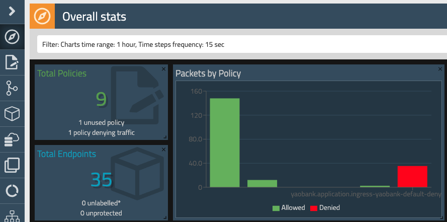
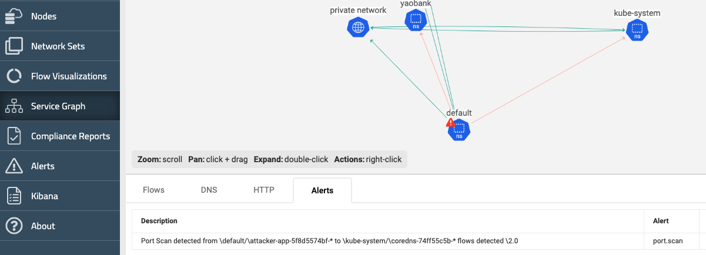
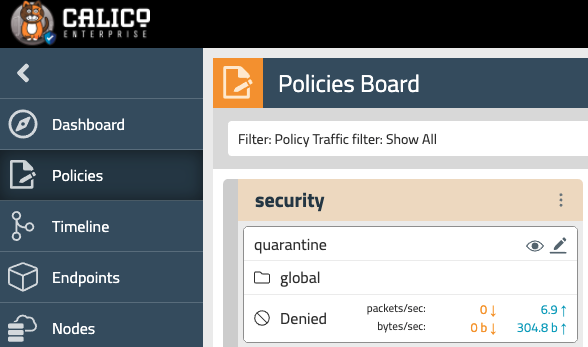
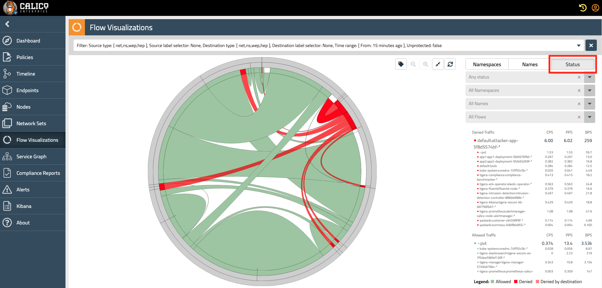

# 10. DOS

In this lab, you will: 
- Implement an alert so you will be informed if any malicious actor is trying to connect to system pods on ports you will not expect 
- Deploy a rogue pod and inspect its behavior by means of the available dashboards and graphs 
- Use the Dynamic Packet Capture feature to gather more details around the malicious activity of the pod 

## 10.1. Flow and DNS logs setup preparation

Workloads and policies are highly dynamic. To troubleshoot Kubernetes clusters, you need logs with workload identity and context. Calico Enterprise deploys an Elasticsearch cluster and Kibana instance during installation with these features:

* Logs with workload context
* Centralized log collection for multiple clusters using Calico Enterprise multi-cluster-management
* View Elasticsearch logs in Calico Enterprise Manager UI (Kibana dashboard and Flow Visualizer) and the Elasticsearch API
* Standard Kubernetes RBAC for granular access control to logs
* Collect/archive logs or subset of logs
* Log aggregation for high-volume logs
* Configure data retention settings to manage cluster disk space
* Integration with third-party tools like Amazon S3, Syslog, Splunk

We will be reducing the flow collection time from the 5 minutes default to 30 seconds for the purpose of the lab:

```
kubectl patch felixconfiguration.p default -p '{"spec":{"flowLogsFlushInterval":"30s"}}'
kubectl patch felixconfiguration.p default -p '{"spec":{"dnsLogsFlushInterval":"30s"}}'
```

## 10.2. Global Alerts

Create an alert which will warn you when pods try to reach your kube-system dns servers in other port different than UDP/TCP 53:

```
kubectl apply -f -<<EOF
apiVersion: projectcalico.org/v3
kind: GlobalAlert
metadata:
  name: port.scan
spec:
  aggregateBy:
  - source_namespace
  - dest_name_aggr
  - source_name_aggr
  - dest_namespace
  - num_flows
  condition: gte
  dataSet: flows
  description: Port scan detected!!!
  field: num_flows
  lookback: 1m0s
  metric: sum
  period: 1m0s
  query: ("dest_port" != 53 AND ("dest_namespace" = "kube-system" AND "dest_labels.labels"
    = "k8s-app=kube-dns"))
  severity: 50
  summary: Port Scan detected from \${source_namespace}/\${source_name_aggr} to \${dest_namespace}/\${dest_name_aggr}
    flows detected \${num_flows}
  threshold: 1
EOF
```

## 10.3. Rogue Pod:

### 10.3.1. Install a Rogue Pod

Install a rogue pod, which will initiate a DoS attack so we can leverage several observability tools in the platform to visualize its impact.

```
kubectl apply -f https://installer.calicocloud.io/rogue-demo.yaml
```

Verify the pod is running:

```
kubectl get pod
```
```
tigera@bastion:~$ kubectl get pod
NAME                            READY   STATUS    RESTARTS   AGE
attacker-app-5f8d5574bf-7s76p   1/1     Running   0          26s
```

### 10.3.2. Create a Quarantine policy

We will create a quarantine network policy before hand, which will match the traffic on a specific label. Later, when we want to quickly isolate a pod, we just need to apply the appropriate label to it, so our network will not be impacted. In our approach so far, we have enabled microsegmentation denying all the ingress traffic in our pods and allowing egress. In order to completely isolate pods with this policy, we will put it higher in the hierarchy so the policy will be implemented in the platform tier. Pods included there will not able to communicate at all.

```
kubectl apply -f -<<EOF
apiVersion: projectcalico.org/v3
kind: GlobalNetworkPolicy
metadata:
  name: security.quarantine
spec:
  egress:
  - action: Deny
    destination: {}
    source: {}
  order: 0
  selector: sec == "quarantine"
  tier: security
  types:
  - Egress
EOF
```

### 10.3.3. Verify the pod activity

Go to the Dashboard. You should start seeing some abnormal increase in the traffic flow in your environemnt in term of number of connections and packets being denied by some of the policies we already implemented.



Switch to the Service graph view. After a couple of minutes of starting the rogue pod, you should be able to see it is opening connections towards your kube-system dns pods and an alert icon signaling those will appear in the pod namespace. The corresponding alerts can also be checked on both, the Alerts tab in the Service Graph page or the Alerts section from Calico Enterprise Manager UI navigation pane.



### 10.3.4. Send the attacker pod traffic to a quarantine rule

Label the attacker pod so it will be included in the quarantine security policy (deny all outgoing traffic from the pod)

```
kubectl label $(kubectl get pod -o name --no-headers | grep attacker) sec=quarantine
```

After doing this, the traffic from our attacker will be denied by a rule in our security tier called "quarantine". You should see outbound packet being denied as shown below.



If you select Flow Visualization in the left navigation bar and switch to the "Status" tab highlighted below you should see this traffic being denied (this is an easy way to understand where there should be traffic hotspots in your network).



## 10.4. Dynamic Packet Capture

### 10.4.1. Define the traffic you want to capture

We will use another feature called Dynamic Packet Capture to get a deeper insight of what the pod is doing. For that, we will use standard manifests files to select the pod from which we want to capture the traffic. Inspect the yaml file below. 

```
apiVersion: projectcalico.org/v3
kind: PacketCapture
metadata:
  name: attacker-pcap
  namespace: default
spec:
  selector: app == "attacker-app"
```

As you can see, this matches any pod labeled as `attacker-app` which for our demonstration purpose, will capture the traffic of the rogue pod:

```
kubectl get pod --show-labels
```
```
NAME                             READY   STATUS    RESTARTS   AGE     LABELS
attacker-app-5f8d5574bf-6htwl    1/1     Running   0          6m57s   app=attacker-app,hello=you,pod-template-hash=5f8d5574bf,sec=quarantine
...
```

### 10.4.2. Start Capturing the traffic

Now, lets implement this capture:

```
kubectl apply -f -<<EOF
apiVersion: projectcalico.org/v3
kind: PacketCapture
metadata:
  name: attacker-pcap
  namespace: default
spec:
  selector: app == "attacker-app"
EOF
```

Check the capture has been initiated:

```
calicoctl get packetcapture -o wide
```
```
NAME            SELECTOR                
attacker-pcap   app == "attacker-app"   
```

This capture will gather traffic from all pods in our cluster labeled as `attacker=app`, which in this case will be a single pod. However, should multiple endpoints match the capture, no matter where they are running in our cluster, their traffic will be captured if they match. Wait for around 1 minute, and then stop the capture deleting it.

```
kubectl delete -f -<<EOF
apiVersion: projectcalico.org/v3
kind: PacketCapture
metadata:
  name: attacker-pcap
  namespace: default
spec:
  selector: app == "attacker-app"
EOF
```

### 10.4.3. Get the capture files, and analyze them

The files will be stored in calico-node and exported by fluentd. We can retrieve the files with the following command.

```
calicoctl captured-packets copy attacker-pcap -d "/tmp"
```

Check the capture file with tcpdump to see what the attacker pod was performing.

```
sudo tcpdump -nr /tmp/attacker*.pcap | tail -40
```

As you can see the pod was performing SYN flood towards different random ports

## 10.5 Clean up the environment

Now delete the rogue pod from the environment.

```
kubectl delete -f https://installer.calicocloud.io/rogue-demo.yaml
```
