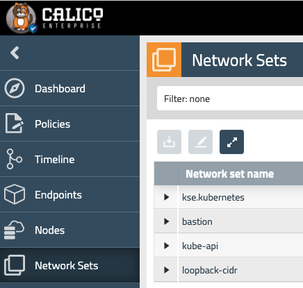

# 3. Network policies - Part 2

In this lab, we will develop our policies to include external communication, cluster hosts, and default deny.

Steps: \
3.1. Define globalnetworkset for external endpoints \
3.2. Implement global egress policies for the cluster \
3.3. Implement host endpoint policies \
3.4. Apply global default deny \
3.5. Test

## 3.1. Define globalnetworkset for external endpoints

In this lab, we will start by defining Calico globalnetworkset for external endpoint. This allows for matching sources and destinations foreign to the cluster in network policies in a cloud-native way. 

```
kubectl apply -f -<<EOF
apiVersion: projectcalico.org/v3
kind: GlobalNetworkSet
metadata:
  name: loopback-cidr
  labels:
    loopback-cidr: 'true'
spec:
  nets:
    - 127.0.0.0/8
---
apiVersion: projectcalico.org/v3
kind: GlobalNetworkSet
metadata:
  name: bastion
  labels:
    bastion: 'true'
    type: 'bastion'
spec:
  nets:
    - 10.0.1.10/32
---
apiVersion: projectcalico.org/v3
kind: GlobalNetworkSet
metadata:
  name: kube-api
  labels:
    kube-api: 'true'
spec:
  allowedEgressDomains:
    - '*.lynx.tigera.ca'
---
apiVersion: projectcalico.org/v3
kind: GlobalNetworkSet
metadata:
  name: trusted-repos
  labels:
    external-ep: trusted-repos
spec:
  allowedEgressDomains:
    - '*.docker.com'
    - '*.quay.io'
    - '*.ubuntu.com'
    - '*.docker.io'
    - gcr.io
EOF
```



After applying the manifest, you will notice 4 new globalnetworksets:
- `loopback` to account for the communication with loopback interface once we enable host endpoint protection (typical behavior of some linux kernel and a common trap to avoid)
- `bastion` to account for communication with bastion host, namely ssh and kube api tcp 6443 port
- `kube-api (*.lynx.tigera.ca)` to account for kube-api fqdn, wildcard used for simplicity
- `trusted-repos` to be able to pull the images for our pods

## 3.2. Implement global egress policies for the cluster

Next we will implement a simple policy that allows egress communication among cluster endpoints, including workload endpoints and host endpoints. This follows a design principle that allows all intra-cluster communication since we will be implementing granular ingress microsegmentation policies. This simplifies the policy implementation while providing comparable security posture. However, for external communication, we will be implementing in later exercises granular egress and ingress policies to workload and host endpoints. 

```
kubectl apply -f -<<EOF
apiVersion: projectcalico.org/v3
kind: GlobalNetworkPolicy
metadata:
  name: security.egress-allow-from-and-to-pods-and-hosts
spec:
  tier: security
  order: 2
  selector: all()
  types:
    - Egress
  egress:
    - action: Allow
      destination:
        selector: all()
EOF
```

Notice the use of the selector All(), which according to the documentation allows for matching both workload and host endpoints

Refer to https://docs.tigera.io/reference/resources/globalnetworkpolicy


## 3.3- Implement host endpoint policies

In this section, we will implement granular ingress and egress host endpoint policies effectively securing the cluster hosts. Hardening the cluster hosts is crucial for ensuring the security of your overall kubernetes environment.

```
kubectl get node -o=custom-columns=NAME:.metadata.name,LABELS:.metadata.labels
```
```
NAME                                         LABELS
ip-10-0-1-20.ca-central-1.compute.internal   map[beta.kubernetes.io/arch:amd64 beta.kubernetes.io/instance-type:t3.medium beta.kubernetes.io/os:linux failure-domain.beta.kubernetes.io/region:ca-central-1 failure-domain.beta.kubernetes.io/zone:ca-central-1a kubernetes.io/arch:amd64 kubernetes.io/hostname:ip-10-0-1-20.ca-central-1.compute.internal kubernetes.io/os:linux node-role.kubernetes.io/control-plane: node-role.kubernetes.io/master: node.kubernetes.io/instance-type:t3.medium topology.kubernetes.io/region:ca-central-1 topology.kubernetes.io/zone:ca-central-1a]
ip-10-0-1-30.ca-central-1.compute.internal   map[beta.kubernetes.io/arch:amd64 beta.kubernetes.io/instance-type:t3.large beta.kubernetes.io/os:linux failure-domain.beta.kubernetes.io/region:ca-central-1 failure-domain.beta.kubernetes.io/zone:ca-central-1a kubernetes.io/arch:amd64 kubernetes.io/hostname:ip-10-0-1-30.ca-central-1.compute.internal kubernetes.io/os:linux node:worker1 node-role.kubernetes.io/worker: node.kubernetes.io/instance-type:t3.large topology.kubernetes.io/region:ca-central-1 topology.kubernetes.io/zone:ca-central-1a]
ip-10-0-1-31.ca-central-1.compute.internal   map[beta.kubernetes.io/arch:amd64 beta.kubernetes.io/instance-type:t3.large beta.kubernetes.io/os:linux failure-domain.beta.kubernetes.io/region:ca-central-1 failure-domain.beta.kubernetes.io/zone:ca-central-1a kubernetes.io/arch:amd64 kubernetes.io/hostname:ip-10-0-1-31.ca-central-1.compute.internal kubernetes.io/os:linux node:worker2 node-role.kubernetes.io/worker: node.kubernetes.io/instance-type:t3.large topology.kubernetes.io/region:ca-central-1 topology.kubernetes.io/zone:ca-central-1a]
```

```
kubectl apply -f -<<EOF
apiVersion: projectcalico.org/v3
kind: GlobalNetworkPolicy
metadata:
  name: security.egress-allow-from-and-to-host
spec:
  tier: security
  order: 3
  selector: has(node-role.kubernetes.io/control-plane)||has(node-role.kubernetes.io/worker)
  types:
    - Egress
    - Ingress
  ingress:
    - action: Allow
      destination:
        ports:
          - 443
      protocol: TCP
    - action: Allow
      destination:
        ports:
          - 68
      protocol: UDP     
    - action: Allow
      protocol: ICMP      
    - action: Allow
      source:
        selector: all()
    - action: Allow
      source:
        selector: bastion == 'true'
      destination:
        ports:
          - 22
          - 6443
      protocol: TCP
  egress:
    - action: Allow
      destination:
        selector: all()
    - action: Allow
      destination:
        ports:
          - 443
      protocol: TCP
    - action: Allow
      protocol: ICMP    
    - action: Allow
      destination:
        selector: loopback-cidr == 'true'
    - action: Allow
      destination:
        selector: infra-trusted-ntp == 'true'
        ports:
          - 123
      protocol: UDP
    - action: Allow
      destination:
        ports:
          - 53
          - 67
      protocol: TCP
    - action: Allow
      destination:
        ports:
          - 53
      protocol: UDP
    - action: Allow
      destination:
        selector: kube-api == 'true'
        ports:
          - 6443
      protocol: TCP
    - action: Allow
      destination:
        selector: external-ep == "trusted-repos"
EOF
```

Notice the use of `selector (has(node-role.kubernetes.io/control-plane) || has(node-role.kubernetes.io/worker))`, which matches both worker and master nodes. Policies are allowing essential cluster communication with the fabric services and kubernetes control plane.

Be aware that Calico implements failsafe rules that override calico policies to make sure you don't break vital services. In production, it recommended to maintain bare minimum fine-tuned failsafe rule for vital service, as a last resort, and implement granular policies for all other service.

Refer to https://docs.tigera.io/security/protect-hosts#failsafe-rules

Automatic HostEndpoints is disabled by default. Enable Automatic HostEndpoints by patching kubecontrollersconfiguration. 

```
kubectl patch kubecontrollersconfiguration default --patch='{"spec": {"controllers": {"node": {"hostEndpoint": {"autoCreate": "Enabled"}}}}}'
```

## 3.4- Apply global default deny

The last step is to configure default deny global rule. This established zero-trust policies where you are allowing the bare minimum for intra-cluster and external communication and denying everyting else.

```
kubectl apply -f -<<EOF
apiVersion: projectcalico.org/v3
kind: GlobalNetworkPolicy
metadata:
  name: default-deny
spec:
  types:
  - Ingress
  - Egress
EOF
```

## 3.5- Test

At this point you have locked down your cluster to the bare minimum communication. 

Let's repeat the test from app1 to the other pod in the same namesapce and to an external destination we did in step 2.4 in the previous lab. Now those two must fail as any communication that is not explicitly allowed is denied.

Let's remember our source pod testing name:

```
APP1_POD=$(kubectl get pod -n app1 --no-headers -o name | head -1) && echo $APP1_POD
```

And the IP address of the other pod in the namespace app1:

```
kubectl get pod -n app1 -o wide | tail -1
```
```
app1-deployment-5bbfd76f9d-mzjzd   1/1     Running   0          14m   10.48.0.212   ip-10-0-1-31.ca-central-1.compute.internal   <none>           <none>
```

Now, let's access our testing pod, and try to ping to the other pod within the same namespace:

```
kubectl exec -ti $APP1_POD -n app1 -- sh
```
```
/ # ping 10.48.0.212
```

The ping must fail as we implemented a zero trust approach. The same will happen towards any pod in the namespace app2 or our external communication.

```
/ # curl -I https://www.tigera.io
```
