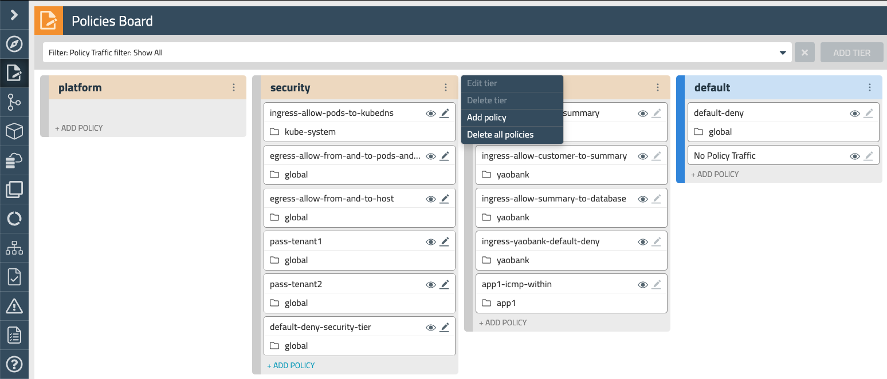
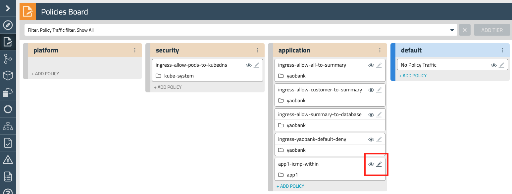

# 5. RBAC for policies

In Calico Enterprise, global network policy and network policy resources are associated with a specific tier. Admins can configure access control for these Calico Enterprise policies using standard Kubernetes Role and ClusterRole resource types. This makes it easy to manage RBAC for both Kubernetes network policies and Calico Enterprise tiered network policies. In this lab we will:

- Create service accounts 
- Implement RBAC controls 
- Verify access to the right policy resources for each account

## 5.1. Create service accounts

We will create two service accounts. One will belong to our security administrator, who will be in charge of implementing network security policies with a broader scope and which affect the whole environment. Those will be created in our security tier.

The second account belongs to our developer. He must be able to access the application, or default tiers, but not able to see or modify any other policy higher in the hierarchy. He will not able to see or edit global policies, as the case of our `default-deny` policy applied in the default tier. Let's create our two service accounts.

```
kubectl apply -f -<<EOF
# security team
apiVersion: v1
kind: ServiceAccount
metadata:
  name: secuser
  namespace: default
---
# developer team
apiVersion: v1
kind: ServiceAccount
metadata:
  name: devuser
  namespace: default
EOF
```
```
serviceaccount/secuser created
serviceaccount/devuser created
```

## 5.2. Create the cluster wide roles

Now let's create the needed cluster roles and bindings to assign the right access to each account. 

```
kubectl apply -f -<<EOF
# allows access to UI components to show flow logs, audit logs, stats
kind: ClusterRole
apiVersion: rbac.authorization.k8s.io/v1
metadata:
  name: ui-traffic-stats
rules:
- apiGroups: [""]
  resources: ["services/proxy"]
  resourceNames: ["https:tigera-api:8080", "calico-node-prometheus:9090"]
  verbs: ["get","create"]
# Access to flow logs, audit logs, and statistics
- apiGroups: ["lma.tigera.io"]
  resources: ["*"]
  # access to specific resources
  resourceNames: ["flows", "audit*", "events", "dns"]
  verbs: ["get"]
- apiGroups: ["projectcalico.org"]
  resources: ["authenticationreviews","authorizationreviews"]
  verbs: ["create"]
---

kind: ClusterRole
apiVersion: rbac.authorization.k8s.io/v1
metadata:
  name: ui-policy-board-reader
rules:
- apiGroups: ["networking.k8s.io","extensions",""]
  resources: ["networkpolicies","namespaces"]
  verbs: ["get","watch","list"]
- apiGroups: ["projectcalico.org"]
  resources: ["tiers","tier.networkpolicies","tier.globalnetworkpolicies"]
  verbs: ["get","watch","list"]
# access to see policy board
- apiGroups: ["projectcalico.org"]
  resources: ["clusterinformations"]
  verbs: ["get","list"]
---

kind: ClusterRole
apiVersion: rbac.authorization.k8s.io/v1
metadata:
  name: security-tier-policy-cruder
rules:
# To access Calico policy in a tier, the user requires get access to that tier.
- apiGroups: ["projectcalico.org"]
  resources: ["tiers"]
  resourceNames: ["security"]
  verbs: ["get"]
# This allows configuration of all types of NetworkPolicy resources in the security tier as well as NetworkSet resources.
- apiGroups: ["projectcalico.org"]
  resources: ["tier.networkpolicies","tier.globalnetworkpolicies","tier.stagedkubernetesnetworkpolicies","stagedkubernetesnetworkpolicies","globalnetworksets","networksets"]
  resourceNames: ["security.*"]
  verbs: ["*"]
- apiGroups: ["projectcalico.org"]
  resources: ["networksets","globalnetworksets"]
  verbs: ["get","watch","list"]
- apiGroups: ["projectcalico.org"]
  resources: ["globalalerts","globalalerts/status","globalalerttemplates"]
  verbs: ["get","watch","list"]
---

##############################################
# allow full access to security tier
##############################################
kind: ClusterRoleBinding
apiVersion: rbac.authorization.k8s.io/v1
metadata:
  name: security-full-access
subjects:
- kind: ServiceAccount
  name: secuser
  namespace: default
roleRef:
  kind: ClusterRole
  name: security-tier-policy-cruder
  apiGroup: rbac.authorization.k8s.io
---

##############################################
# grant access to APIs in Enterprise Manager UI
##############################################
kind: ClusterRoleBinding
apiVersion: rbac.authorization.k8s.io/v1
metadata:
  name: tmui-traffic-stats-access
subjects:
- kind: ServiceAccount
  name: secuser
  namespace: default
roleRef:
  kind: ClusterRole
  name: ui-traffic-stats
  apiGroup: rbac.authorization.k8s.io
---

##############################################
# grant access to Enterpris Manager policy board view
##############################################
kind: ClusterRoleBinding
apiVersion: rbac.authorization.k8s.io/v1
metadata:
  name: tmui-policy-board-access
subjects:
- kind: ServiceAccount
  name: secuser
  namespace: default
roleRef:
  kind: ClusterRole
  name: ui-policy-board-reader
  apiGroup: rbac.authorization.k8s.io
EOF
```
```
kubectl apply -f -<<EOF
kind: ClusterRole
apiVersion: rbac.authorization.k8s.io/v1
metadata:
  name: tier-reader-dev
rules:
- apiGroups: ["projectcalico.org"]
  resources: ["tiers"]
  resourceNames: ["default"]
  verbs: ["get"]
# only allow to view global and namespaced policies in default tier
- apiGroups: ["projectcalico.org"]
  resources: ["tier.networkpolicies"]
  resourceNames: ["default.*"]
  verbs: ["get","list"]
  
---

kind: ClusterRole
apiVersion: rbac.authorization.k8s.io/v1
metadata:
  name: ui-policy-board-reader-dev
rules:
- apiGroups: ["networking.k8s.io","extensions",""]
  resources: ["networkpolicies","namespaces"]
  verbs: ["get","watch","list"]
- apiGroups: ["projectcalico.org"]
  resources: ["tiers","tier.networkpolicies"]
  verbs: ["get","watch","list"]
# access to see policy board
- apiGroups: ["projectcalico.org"]
  resources: ["clusterinformations"]
  verbs: ["get","list"]

---

##############################################
# allow read access to default tier
##############################################
kind: ClusterRoleBinding
apiVersion: rbac.authorization.k8s.io/v1
metadata:
  name: tier-reader-dev
subjects:
- kind: ServiceAccount
  name: devuser
  namespace: default
roleRef:
  kind: ClusterRole
  name: tier-reader-dev
  apiGroup: rbac.authorization.k8s.io
  
---

##############################################
# grant access to APIs in Enterprise Manager UI
##############################################
kind: ClusterRoleBinding
apiVersion: rbac.authorization.k8s.io/v1
metadata:
  name: tmui-traffic-stats-access-dev
subjects:
- kind: ServiceAccount
  name: devuser
  namespace: default
roleRef:
  kind: ClusterRole
  name: ui-traffic-stats
  apiGroup: rbac.authorization.k8s.io
  
---

##############################################
# grant access to Enterpris Manager policy board view
##############################################
kind: ClusterRoleBinding
apiVersion: rbac.authorization.k8s.io/v1
metadata:
  name: tmui-policy-board-access-dev
subjects:
- kind: ServiceAccount
  name: devuser
  namespace: default
roleRef:
  kind: ClusterRole
  name: ui-policy-board-reader-dev
  apiGroup: rbac.authorization.k8s.io
EOF
```

As you can see, both accounts are associated with the roles "ui-traffic-stats" and "ui-policy-board-reader". However, only the security person (`secuser`) have full access to the security tier through the role "security-tier-policy-cruder". The other service account (`devsuer`) can only work in the application and default tiers. 


## 5.3. Restrict the developer user to a namespace

And now, lets restrict even more the devuser to the app1 namespace by means that a role and binding:

```
kubectl apply -f -<<EOF
kind: Role
apiVersion: rbac.authorization.k8s.io/v1
metadata:
  name: app1-user-full-access
  namespace: app1
rules:
- apiGroups: ["", "extensions", "apps"]
  resources: ["*"]
  verbs: ["*"]
- apiGroups: ["batch"]
  resources:
  - jobs
  - cronjobs
  verbs: ["*"]
  rules:
- apiGroups: ["projectcalico.org"]
  resources: ["tiers"]
  resourceNames: ["default"]
  verbs: ["get"]
- apiGroups: ["projectcalico.org"]
  resources: ["tier.networkpolicies"]
  resourceNames: ["default.*","application.*"]
  verbs: ["create",]
# allow CRUD operations against staged policies in default and application tier
- apiGroups: ["projectcalico.org"]
  resources: ["tier.networkpolicies","tier.stagedkubernetesnetworkpolicies","stagedkubernetesnetworkpolicies"]
  resourceNames: ["default.*","application.*"]
  verbs: ["get","list","create","update","patch","delete"]

---

kind: RoleBinding
apiVersion: rbac.authorization.k8s.io/v1
metadata:
  name: app1-user-view
  namespace: app1
subjects:
- kind: ServiceAccount
  name: devuser
  namespace: default
roleRef:
  apiGroup: rbac.authorization.k8s.io
  kind: Role
  name: app1-user-full-access

---

kind: Role
apiVersion: rbac.authorization.k8s.io/v1
metadata:
  name: app1-user-partial-access
  namespace: default
rules:
- apiGroups: ["", "extensions", "apps"]
  resources: ["*"]
  verbs: ["*"]
- apiGroups: ["batch"]
  resources:
  - jobs
  - cronjobs
  verbs: ["*"]
  rules:
- apiGroups: ["projectcalico.org"]
  resources: ["tiers"]
  resourceNames: ["default"]
  verbs: ["get"]
- apiGroups: ["projectcalico.org"]
  resources: ["tier.networkpolicies"]
  resourceNames: ["default.*","application.*"]
  verbs: ["create",]
# allow CRUD operations against staged policies in default tier
- apiGroups: ["projectcalico.org"]
  resources: ["tier.networkpolicies","tier.stagedkubernetesnetworkpolicies","stagedkubernetesnetworkpolicies"]
  resourceNames: ["default.*","application.*"]
  verbs: ["get","list","create","update","patch","delete"]

---

kind: RoleBinding
apiVersion: rbac.authorization.k8s.io/v1
metadata:
  name: default-ns-user-view
  namespace: default
subjects:
- kind: ServiceAccount
  name: devuser
  namespace: default
roleRef:
  apiGroup: rbac.authorization.k8s.io
  kind: Role
  name: app1-user-partial-access
EOF
```

## 5.4. Verification

To check, retrieve the tokens for both accounts as indicated below and open two new Incognito windows and browse to the Tigera Manager UI in `https://manager.<LABNAME>.lynx.tigera.ca`. Then access each window with the respective user token.

```
kubectl get secret $(kubectl get serviceaccount secuser -o jsonpath='{range .secrets[*]}{.name}{"\n"}{end}' | grep token) -o go-template='{{.data.token | base64decode}}' && echo
```
```
kubectl get secret $(kubectl get serviceaccount devuser -o jsonpath='{range .secrets[*]}{.name}{"\n"}{end}' | grep token) -o go-template='{{.data.token | base64decode}}' && echo
```

You can see the security user can edit and create policies in the Security Tier as indicated in the image below. He can see any global policy too and configure them in that tier.



On other hand, the devuser can only edit the application tier rules in its own namespace, non-kubernetes policies in the default tier, and he cannot create/edit or see global policies.



If you recall the previous lab, we implemented tenant rules in our security Tier so we could delegate more specific control to the owners of the namespace. Using Kubernetes RBAC, we implemented the principle of least privilege by giving just enough access to each tenant to perform their required tasks.
