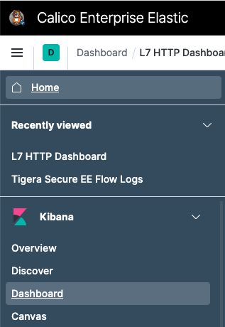
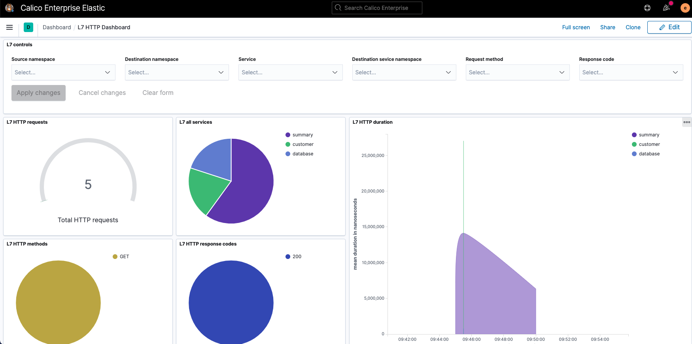

# 9 Observability - Dashboards

In this lab, we will enable application layer data in flow logs.

Steps: \
9.1 Create tigera pull secret in app namespace \
9.2 Setup Envoy for application use \
9.3 Enable sidecar for targeted application pod \
9.4 Check the DNS Dashboard in Kibana


## 9.1 Create tigera pull secret in app namespace

Application layer data extends the default Calico flow logs adding layer 7 contextual information about the request. Calico enterprise provides extensive logging and observability featureset that Calico Enterprise uses in many functions, including threat defense, anomaly detection, machine learning, compliance reporting, service graph, policy recommendations, and many other functions. Logs can be also forwarded to your external SIEM for long term retention and compliance.

```
kubectl create secret generic tigera-pull-secret -n yaobank --from-file=.dockerconfigjson=/home/tigera/config.json --type kubernetes.io/dockerconfigjson
```

## 9.2 Setup Envoy for application use

Let's deploy and setup Envoy for integration with Calico Enterprise and application use. Calico uses Envoy as the medium for extracting application layer contextual information. 

```
curl https://docs.tigera.io/manifests/l7/patch-envoy.yaml -O
```
```
  % Total    % Received % Xferd  Average Speed   Time    Time     Time  Current
                                 Dload  Upload   Total   Spent    Left  Speed
100  1693  100  1693    0     0   5008      0 --:--:-- --:--:-- --:--:--  5008
```
```
cat patch-envoy.yaml
```
```
spec:
  template:
    spec:
      containers:
      - name: envoy-proxy
        image: quay.io/tigera/envoy:v3.7.0
        imagePullPolicy: IfNotPresent
        securityContext:
          runAsUser: 1729
          runAsGroup: 1729
          runAsNonRoot: true
        env:
        - name: ENVOY_UID
          value: '1729'
        - name: ENVOY_GID
          value: '1729'
        volumeMounts:
        - name: envoy-config
          mountPath: /etc/envoy
        - name: envoy-logs
          mountPath: /tmp/
      - name: l7-collector
        image: quay.io/tigera/l7-collector:v3.7.0
        imagePullPolicy: IfNotPresent
        env:
        - name: LOG_LEVEL
          value: "Panic"
        - name: FELIX_DIAL_TARGET
          value: "/var/run/felix/nodeagent/socket"
        volumeMounts:
        - name: envoy-logs
          mountPath: /tmp/
        - name: felix-sync
          mountPath: /var/run/felix
      imagePullSecrets:
      - name: tigera-pull-secret
      volumes:
      - name: envoy-logs
        emptyDir: {}
      - name: felix-sync
        flexVolume:
          driver: nodeagent/uds
      - name: envoy-config
        configMap:
          name: envoy-config
      initContainers:
      - name: envoy-init
        image: quay.io/tigera/envoy-init:v3.7.0
        imagePullPolicy: IfNotPresent
        securityContext:
          allowPrivilegeEscalation: false
          capabilities:
            add:
            - NET_ADMIN
            - NET_RAW
            - SETGID
            - SETUID
            drop:
            - ALL
          privileged: false
          readOnlyRootFilesystem: false
          runAsGroup: 0
          runAsNonRoot: false
          runAsUser: 0
```
```
curl https://docs.tigera.io/manifests/l7/envoy-config.yaml -O
```
```
  % Total    % Received % Xferd  Average Speed   Time    Time     Time  Current
                                 Dload  Upload   Total   Spent    Left  Speed
100  8184  100  8184    0     0  19912      0 --:--:-- --:--:-- --:--:-- 19864
```
```
kubectl create configmap envoy-config -n yaobank --from-file=envoy-config.yaml
```

## 9.3. Enable sidecar for targeted application pod

Next enable yaobank to use Envoy. This will give us layer 7 visibility into micro-services communication. Notice the deployment of 2 sidecars alongside the app container, envoy and l7-collector. The function of l7-collector is to integrate with Envoy and extract flowlog data. Also notice that one of the steps includes enabling flowlogs for hostendpoints which is disabled by default. 

```
kubectl patch felixconfiguration default --type='merge' -p '{"spec":{"policySyncPathPrefix":"/var/run/nodeagent"}}'
```
```
kubectl get deployment -n yaobank
```
```
NAME       READY   UP-TO-DATE   AVAILABLE   AGE
customer   1/1     1            1           2d16h
database   1/1     1            1           2d16h
summary    2/2     2            2           2d16h
```
```
kubectl patch deployment customer -n yaobank --patch "$(cat patch-envoy.yaml)"
```
```
kubectl patch deployment database -n yaobank --patch "$(cat patch-envoy.yaml)"
```
```
kubectl patch deployment summary -n yaobank --patch "$(cat patch-envoy.yaml)"
```
```
kubectl patch felixconfiguration default -p '{"spec":{"flowLogsEnableHostEndpoint":true}}'
```

Wait until the yaobank application is redeployed with the additional containers running as sidecars inside the pod 

```
watch kubectl get pod -n yaobank
```
```
NAME                        READY   STATUS        RESTARTS   AGE
customer-78647ff759-25p2z   3/3     Running       0          71s
database-78f6d54974-bjwcv   3/3     Running       0          66s
summary-77f9d5f98c-dbjkw    3/3     Running       0          54s
summary-77f9d5f98c-fhdmr    3/3     Running       0          57s
```

## 9.4. Verify The Application Level Dashboard

We need to retrieve the password for kibana you wrote down in previous labs. If you forgot to do so then execute the command below:

```
kubectl -n tigera-elasticsearch get secret tigera-secure-es-elastic-user -o go-template='{{.data.elastic | base64decode}}' && echo
```

Before Checking the Dashboards, let's generate some http traffic for our yaobank application:

```
touch /tmp/runscript ; while [ -f /tmp/runscript ] ; do curl -si $(kubectl get svc -n yaobank | grep customer | awk {'print $3'}) | head -1 ; sleep 2 ; done &
```

You will start seeing some HTTP responses displayed. This will keep running until we remove a file, but for now leave it running.

Access kibana from the left tool bar with the icon . The default username is `elastic`.

Now select the Dashboards as indicated in the figure below, and then L7 HTTP Dashboard:



There you will see the Application level Dashboard for the yaobank application



## 9.5 Cleanup

In the terminal where the script is running, execute the following command to stop the script (copy and paste to your terminal):

```
rm /tmp/runscript
```

After hitting the `Enter` key a couple of times, you should see a message as the one below:

```
[1]+  Done                    while [ -f /tmp/runscript ]; do
    curl -si $(kubectl get svc -n yaobank | grep customer | awk {'print $3'}) | head -1; sleep 2;
done
```

